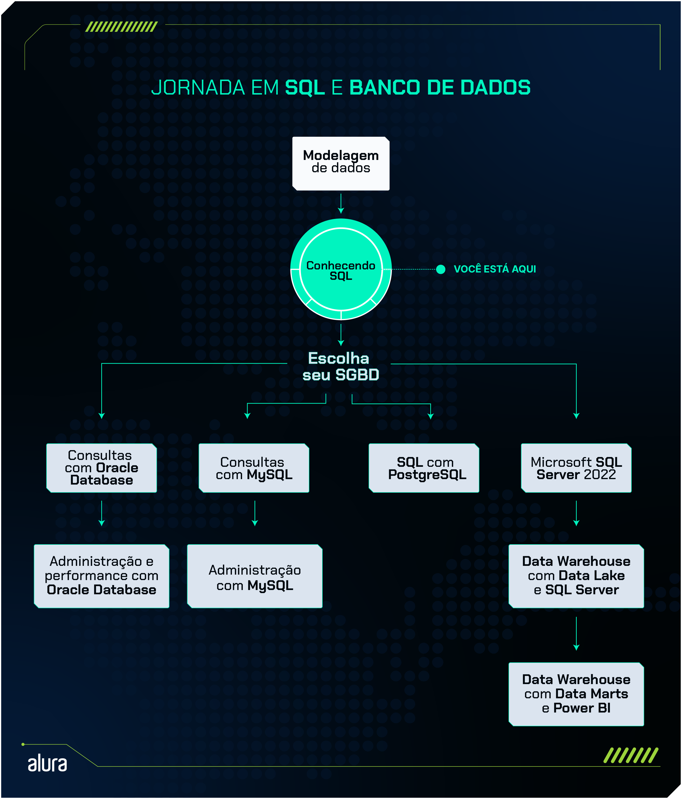

# [Formação Conhecendo SQL](https://cursos.alura.com.br/formacao-conhecendo-sql)

SQL, uma linguagem estruturada para consultas a bancos de dados relacionais, que nos permite consultar e manipular os dados.

  Nesta formação, você aprenderá a criar e gerenciar bancos de dados e tabelas, realizando operações diversas como consultas, atualizações e exclusão de dados. Aprofundaremos nas técnicas de filtragem para busca eficiente de informações, exploraremos recursos avançados para a elaboração de relatórios detalhados, e finalizaremos com a aplicação de SQL na análise de dados, proporcionando uma compreensão abrangente e prática da gestão de dados com SQL.

##

## 1º Passo - Conhecendo o SQL

 Neste primeiro passo, exploraremos o SQLite em sua versão online. Nosso objetivo inicial é criar tabelas e importar dados. Posteriormente, vamos nos aprofundar em consultas, utilizando o comando SELECT para selecionar dados específicos. Além disso, introduziremos a cláusula WHERE, que nos permite filtrar dados com precisão. Também aprenderemos a atualizar registros usando o comando UPDATE. Por fim, conheceremos a cláusula DELETE, essencial para excluir dados de forma segura e eficiente.

## [Curso de SQLite online: conhecendo instruções SQL](https://cursos.alura.com.br/course/sqlite-online-conhecendo-instrucoes-sql)

### **Principais tópicos do curso**

- Conhecendo a linguagem SQL desde sua origem
- Utilizando o SQLite online
- Aprendendo os comandos para criar, alterar, excluir tabelas e inserir dados
- Utilizando filtros em minhas consultas
- Realizando diversos tipos de consultas no banco de dados

### **[Documentação SQLite](https://www.sqlite.org/docs.html)**
